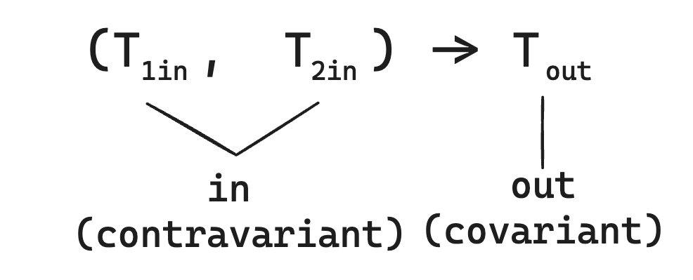

### 11.3 변성은 제넥릭과 타입 인자 사이의 하위 타입 관계를 기술

변성 (variance) 개념은 List<String>과 List<Any>와 같이 기저 타입이 같고 타입 인자가 다른 여러 타입이 서로 어떤 관계가 있는지 설명하는 개념이다.

### 11.3.1 변성은 인자를 함수에 넘겨도 안전한지 판단하게 해준다.

List<Any> 타입의 파라미터를 받는 함수에 List<String>을 넘기면 안전할까? String 클래스는 Any를 확장하므로 Any 타입 값을 파라미터로 받는 함수에 String 값을 넘겨도 절대 안전하다. 하지만 반대인 경우 자신있게 안전성을 말할 수 없다.

```kotlin
fun addAnser(list: MutableList<Any>) {
    list.add(42)
}

fun main() {
    val strings = mutableListOf("abc", "bac")
    addAnser(strings)
    println(strings.maxBy { it.length })
}
```

컴파일러가 이 식을 받아들인다면 정수를 문자열 리스트 뒤에 추가할 수 있다. 따라서 이 함수 호출은 컴파일될 수 없다. 이 예제는 MutableList<Any>가 필요한 곳에 MutableList<String>을 넘기면 안된다는 사실을 보여준다. 코틀린 컴파일러는 실제 이런 함수 호출을 금지한다.

### 11.3.2 클래스, 타입, 하위 타입

변수의 타입이 그 변수에 담을 수 있는 값의 집합을 지정한다고 설명했다. 이 책에서는 타입과 클래스라는 용어를 서로 자주 혼용해 왔다 하지만 그 둘은 같지 않다. 이제는 타입과 클래스의 차이를 설명할 거싱다.

타입 사이의 관계를 논의하려면 하위 타입이라는 개념을 잘 알아야한다. 어떤 타입 A의 값이 필요한 모든 장소에 어떤 타입 B의 값을 넣어도 아무 문제가 없다면 타입 B는 타입 A의 하위 타입이다. 상위 타입은 하위 타입의 반대이다. A 타입이 B 타입의 하위 타입이라면 B는 A의 상위 타입이다.

> 어떤 타입이 다른 타입의 하위 타입인지 검사하기

```kotlin
fun test(i : Int) {
    val n: Number = i
    fun f (s : String) {}
    f(i) // Int 가 String의 하위 타입이 아니어서 컴파일 되지 않는다.
}
```

어떤 값의 타입이 변수 타입의 하위 타입인 경우에만 값을 변수에 대입하도록 허용한다. 따라서 f 함수 호출은 컴파일 되지 않는다. 간단한 경우 하위 타입은 하위 클래스와 근본적으로 같다. 예를 들어 int 클래스는 Number의 하위 클래스이므로 Int는 Number의 하위 타입이다.

밑은 널이 될 수 있는 타입은 하위 타입과 하위 클래스가 같지 않은 경우를 보여준다.

```
A -> A? (O)
Int -> Int? (O)
Int? -> Int (X)
```

널이 될 수 없는 타입은 널이 될 수 있는 타입의 하위 타입이다. 하지만 두 타입 모두 같은 클래스에 해당한다. 항상 널이 될 수 없는 타입의 값을 널이 도리 수 있는 타입의 변수에 저장할 수 있지만 반대로는 불가능하다. 이 때문에 널이 될 수 없는 타입은 널이 될 수 있는 타입의 하위 타입이 된다.

> 밑은 합법적인 대입이다.

```kotlin
val s : String = "abc"
val t : String? = s // String이 String? 의 하위 타입이므로 가능하다
```

앞에서 제네릭 타입을 얘기할 때 특히 하위 클래스와 하위 타입의 차이가 중요해진다. "List<Any>를 파라미터로 받는 함수에 List<String> 타입의 값을 전달해도 괞찬은가?"는 다시 쓰면 "List<String>은 List<Any>의 하위 타입인가?" 다.

어떤 제네릭 타입이 있는데 서로 다른 두 타입 A와 B에 대해 MutableList<A>가 항상 MutableList<B>의 하위 타입도 아니고 사우이 타입도 아닌 경우에 제네릭 타입이 타입 파라미터에 대해 무공변(invariant)이라고 말한다. 자바에서는 모든 클래스가 무공변이다.

앞 절에서 하위 타입 규칙이 다른 클래스를 이미 봤다. 코틀린의 list 인터페이스는 읽기 전용 컬렉션을 표현한다. A가 B의 하위 타입이면 List<A>는 List<B> 의 하위 타입이다. 그런 클래스나 인터페이스를 공변적 (covariant)이라고 말한다.

### 11.3.3 공변성은 하위 타입 관계를 유지한다.

공변적인 클래스는 제네릭 클래스에 대해 A가 B의 하위 타입일 때 Producer<A>가 Producer<B>의 하위 타입인 경우를 말한다. 이를 "하위 타입 관계를 유지한다."라고 말한다.

코틀린에서 제네릭 클래스가 타입 파라미터에 대해 공변적임을 표시하려면 타입 파라미터 이름 앞에 out을 넣어야한다.

> 클래스가 T에 대해 공변적이라고 선언

```kotlin
interface Producer<out T> {
  fun produce(): T
}
```

클래스의 타입 파라미터를 공변적으로 만들면 함수 정의에 사용한 파라미터 타입과 타입 인자의 타입이 정확히 일치하지 않더라도 그 클래스의 인스턴스를 함수인자나 반환값으로 사용할 수 있다.

> 무공변 컬렉션 역할을 하는 클래스 정의

```kotlin
open class Animal {
    fun feed() { /*...*/ }
}

class Herd<T: Animal> {
    val size: Int get() { /*...*/ }
    operator fun get(i: Int): T { /*...*/ }
}

fun feedAll(animals: Herd<Animal>) {
    for (i in 0..< animals.size) {
        animals[i].feed()
    }
}
```

이제 우리가 고양이 무리를 만들어서 관리한다고 하자.

> 컬렉션과 비슷한 무공변인 클래스 사용

```kotlin
class Cat : Animal() {
    fun cleanLitter() { /*...*/ }
}

fun takeCareOfCats(cats: Herd<Cat>) {
    for (i in 0..<cats.size) {
        cats[i].cleanLitter()
    }
    // feedAll(cats) // Error : inferred type is Herd<Cat>, but Herd<Animal> was expected
}
```

불행히도 고양이들은 여전히 배고플것이다. feedAll 함수에 고양이 무리를 넘기면 타입 불일치 오류를 볼 수 있다. Herd 클래스의 T 타입 파라미터에 대해 아무 변성도 지정하지 않았기 때문에 고양이 무리는 동물 무리의 하위 클래스가 아니다

> 컬렉션 역할을 하는 공변적인 클래스 사용하기

```kotlin
class Herd<out T: Animal> {
  ...
}

fun takeCareOfCats(cats: Herd<Cat>) {
    for (i in 0..<cats.size) {
        cats[i].cleanLitter()
    }
    feedAll(cats)
}
```

모든 클래스를 공변적으로 만들 수는 없다. 공변적으로 만들면 안전하지 못한 클래스도 있기 때문이다. 타입 파라미터를 공변적으로 지정하면 클래스 내부에서 그 파라미터를 사용하는 방법을 제한한다. 타입 안전성을 보장하기 위해 공변적 파라미터는 항상 아웃(out)위치에만 있어야한다. 이는 클래스가 T 타입의 값을 생산할 수는 있지만 소비할 수는 없다는 뜻이다.

클래스 멤버를 선언할 때 타입 파라미터를 사용할 수 있는 지점은 모두 인과 아웃위치로 나뉜다. T라는 타입 파라미터를 선언하고 T를 사용하는 함수가 멤버로 있는 클래스를 생각해보자 T가 함수의 반환 타입에 쓰인다면 T는 아웃 위치에 있다. 그 함수는 T 타입의 갑승ㄹ 생산한다. T가 함수의 파라미터 타입에 쓰인다면 T인 위치에 있다. 그런 함수는 T 타입의 값을 소비한다.



클래스 타입 파라미터 T 앞에 out 키워드를 붙이면 클래스 안에서 T를 사용하는 메서드가 아웃 위치에서만 T를 사용하도록 허용하고 인 위치에서는 T를 사용하지 못하게 막는다. out 키워드는 T의 사용법을 제한하며 T로 인해 생기는 하위 타입 관계의 타입 안전성을 보장한다.

예를 들어 Herd 클래스를 생각해보자 Herd에서 타입 파라미터 T를 사용하는 장소는 오직 get 메서드의 반환 타입 뿐이다.

```kotlin
class Herd<T: Animal> {
    val size: Int get() { /*...*/ }
    operator fun get(i: Int): T { /*...*/ } // T를 반환 타입으로 사용한다.
}
```

이 위치(함수의 반환 타입)은 아웃 위치이다. 따라서 이 클래스를 공변적으로 선언해도 안전하다. Herd<Animal>의 get을 호출하는 모든 코드는 Cat이 Animal의 하위 타입이기 때문에 전혀 문제 없이 작동한다.

정리하면 타입 파라미터 T에 붙은 out 키워드는 다음 2가지를 함께 의미한다.

- 하위 타입 관계가 유지된다 (Producer<Cat>은 Producer<Animal>의 하위 타입이다.)
- T를 아웃 위치에서만 사용할 수 있다.

이제 list<T> 인터페이스를 보자. 코틀린 List는 읽기 전용이다. 따라서 그 안에는 T 타입의 원소를 반환하는 get 메서드는 있지만 리스트에 T 타입의 값을 추가하거나 리스트에 있는 기존 값을 변경하는 메서드는 없다. 따라서 List는 T에 대해 공변적이다.

```kotlin
interface List<out T>: Collection<T> {
  // 읽기 전용 메서드로 T를 반환하는 메서드만 정의한다.
  operator fun get(index: Int): T
}
```

타입 파리미터를 함수의 파라미터 타입이나 반환 타입에만 쓸 수 있는 것은 아니다. 타입 파라미터를 다른 타입의 타입 인자로 사용할 수도 있다. 예를 들어 List 인터페이스에는 List<T>를 반환하는 subList 라는 메서드가 있다.

```kotlin
interface List<out T>: Collection<T> {
  fun subList(fromIndex: Int, toIndex: Int) : List<T>
}
```

이 경우 subList 함수에 쓰인 T는 아웃 위치에 있다.

생성자 파라미터는 인이나 아웃 위치 어느쪽도 아니라는 사실에 유의하자. 타입 파라미터가 out이라 하더라도 그 타입을 여전히 생성자 파라미터 선언에 사용할 수 있다.

```kotlin
class Herd<out T: Animal>(vararg animals: T) ...
```

변셩은 코드에서 위험할 여지가 있는 메서드를 호출할 수 없게 만듦으로써 제네릭 타입의 인스턴스 역할을 하는 클래스 인스턴스를 잘못 사용하는 일이 없게 방지하는 역할을 한다. 생성자는 나중에 호출할 수 있는 메서드가 아니다. 따라서 생성자는 위험할 여지가 없다.

하지만 val이나 var 키워드를 생성자 파라미터에 적는다면 게터나 세터를 정의하는 것과 같다. 따라서 읽기 전용 프로퍼티는 아웃 위치, 변경 가능 프로퍼티는 아웃과 인 위치 모두에 해당한다.

```kotlin
class Herd<T: Animal>(var leadAnimal:T, vararg animals: T) ...
```

여기서 T 타입인 leadAnimal 프로퍼티가 인 위치에 있기 때문에 T를 out으로 표시할 수 없다. 또한 이런 위치 규칙은 오직 외부에서 볼 수 있는 클래스 (public, protected, internal) API에만 적용할 수 있다. 비공개 메서드의 파라미터는 인도 아니고 아웃도 아닌 위치다. 변성 규칙은 클래스 외부의 사용자가 클래스를 잘못 사용하는 일을 막기 위한 것이므로 클래스 내부 구현에는 적용되지 않는다.

```kotlin
class Herd<out T: Animal>(private var leadAnimal:T, vararg animals: T) ...
```

이 코드의 경우 Herd를 T에 대해 공변적으로 선언해도 안전하다. leadAnimal 프로퍼티가 비공개이기 때문이다. 클래스의 타입 파라미터가 인 위치에서만 쓰이는 경우에는 어떤 일이 생길지 궁금할 것이다.

### 11.3.4 반공변성은 하위 타입 관계를 뒤집는다.
