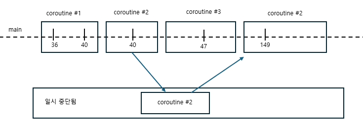

### 14.1 동시성과 병렬성

코틀린 동시성 프로그래밍을 깊이 들여다보기 전에 먼저 동시성이라는 말을 어떤 의미로 정의하는지 살펴보자. 그리고 동시성과 병렬성 개념 사이의 관계도 살펴보자. 동시성은 여러 작업을 동시에 실행하는 것을 말한다. 하지만 모든 작업을 물리적으로 함께 실행할 필요는 없다. 코드의 여러 부분을 돌아가면서 실행하는것도 동시성 시스템이다. 이는 CPU 코어가 하나뿐인 시스템에서 실행되는 애플리케이션까지도 동시성을 사용할 수 있다는 뜻이다. 이런경우 여러 동시성 테스크를 계속 전환해가면서 동시성을 달성한다. 코드가 하나뿐이라 하더라도 사용자 인터페이스의 반응성을 유지하면서 복잡한 계산을 수행하기에 충분할 수 있다.

동시성은 코드를 여러 부분으로 나눠 동시에 수행할 수 있는 능력을 말하는 반면, 병렬성은 여러 작업을 여러 CPU 코어에서 물리적으로 동시에 실행하는 것을 말한다. 병렬 계산은 현대적 멀티코어 하드웨어를 효과적으로 사용할 수 있고, 효율을 더 높이는 경우도 많다. 하지만 병렬성에도 어려운 점이 있다.

### 14.2 코틀린의 동시성 처리 방법 : 일시 중단 함수와 코루틴

코루틴은 코틀린의 강력한 특징으로, 비동기적으로 실행되는 넌블로킹 동시성 코드를 우아하게 작성할 수 있게 해준다. 스레드와 같은 전통적 방법과 비교하면 코루틴이 훨씬 더 가볍게 작동한다. 구조화된 동시성을 통해 콕루틴은 동시성 작업과 그 생명주기를 관리할 수 있는 기능도 제공한다.

이 장에서는 코틀린 코루틴과 전통적인 스레드를 비교하는 것부터 시작한다.

### 14.3 스레드와 코루틴 비교

JVM에서 병령 프로그래밍과 동시성 프로그래밍을 위한 고전적인 추상화는 스레드를 사용하는 것이다. 스레드는 서로 독립적으로 동시에 실행되는 코드 블록을 지정할 수 있게 해준다.

> 스레드

```kotlin
import kotlin.concurrent.thread

fun main() {
    println("I'm on ${Thread.currentThread().name}")
    thread {
        println("And I'm on ${Thread.currentThread().name}")
    }
}

// I'm on main
// And I'm on Thread-0
```

스레드는 애플리케이션을 더 반응성 있게 만들어주고, 멀티코어 CPU의 여러 코어에 작업을 분산시켜 현대적 시스템을 더 효율적으로 사용할 수 있게 해준다. 그러나 애플리케이션에서 스레드를 사용하는 데는 비용이 든다. 일반적으로 스레드는 운영체제가 관리를 하며, 이러한 시스템 스레드를 생성하고 관리하는 것은 비용이 많이 든다. 최신 시스템이더라도 한번에 몇 천개의 스레드만 효과적으로 관리할 수 있다. 각 시스템 스레드는 몇 메가바이트의 메모리를 할당받아야하고, 스레드 간 전환은 운영체제 커널 수준에서 실행되는 작업이다. 이러한 할당과 전환 비용이 합쳐지면서 서로 배가 된다.

코틀린은 스레드에 대한 대안으로 코루틴이라는 추상화를 도입했다. 코루틴은 일시 중단 가능한 계산을 나타낸다. 코틀린 코루틴은 일반적으로 스레드를 사용했을법한 경우에 사용할 수 있지만 몇가지 장점이 있다.

- 코루틴은 초경량 추상화이다.
  - 일반적인 노트북에서 100,000개 이상의 코루틴을 쉽게 실행할 수 있다. 이는 코루틴이 생성,관리에 대한 비용이 저렴한것을 알 수 있다.
- 코루틴은 시스템 자원을 블록시키지 않고 실행을 일시 중단할 수 있으며 나중에 중단된 지점에서 실행을 재개할 수 있다.
  - 이는 코루틴이 네트워크 요청이나 입출력 작업 같은 비동기 작업을 처리할 때 블로킹 스레드보다 훨씬 효율적이라는 의미이다.
- 코루틴은 구조화된 동시성(structured concurrency)이라는 개념을 통해 동시 작업의 구조와 계층을 확립하며, 취소 및 오류 처리를 위한 메커니즘을 제공한다.

세부적으로 코루틴은 하나 이상의 JVM 스레드에서 실행된다. 이는 코루틴을 사용해 작성한 코드도 여전히 기본 스레드 모델이 제공하는 병렬성을 활용할 수 있지만, 운영체제가 부과하는 스레드의 한계에 얽매이지 않는다는 것을 의미한다.

### 14.4 잠시 멈출 수 있는 함수 : 일시 중단 함수

코틀린 코루틴이 스레드, 반응형 스트림, 콜백과 같은 다른 동시성 접근 방식과 다른 핵심 속성으로는 상당수의 경우 코드 '형태'를 크게 변경할 필요가 없다는 점이다. 코드는 여전히 순차적으로 보인다. 일시 중단 함수가 어떻게 이런 방식을 가능하게 하는지 자세히 살펴보자.

### 14.4.1 일시 중단 함수를 사용한 코드는 순차적으로 보인다.

코틀린에서 일시 중단 함수가 어떻게 동작하는 지 살펴보자

> 여러 함수를 호출하는 블로킹 코드 작성하기

```kotlin
fun login(credentials: Credentials) : UserID
fun loadUserData(userID: UserID): UserData
fun showData(data: UserData)

fun showUserInfo(credentials: Credentials) {
  val userID = login(credentials)
  val userData = loadUserData(userID)
  showData(userData)
}
```

계산적인 관점에서 보면 이 코드는 실제로 많은 작업을 수행하지는 않는다. 대부분의 시간을 네트워크 작업 결과를 기다리는데 소모하며, showUserInfo 함수가 실행중인 스레드를 블록시킨다. 앞에서 언급한 것 처럼 스레드를 블록하는 것은 바람직하지 않다. 블록된 스레드는 자원을 낭비하며, 현대적 시스템이 처리할 수 있는 시스템 스레드의 수는 수천개에 불과하다. 이 함수를 사용하면 작업이 완료될 때까지 전체 사용자 인터페이스가 멈추게 될 것이다. 이런 사용자 경험과 시스템 성능의 저하는 코드에 문제가 있다는 사실을 명확히 보여준다.

코루틴, 더 정확히 말해 일시 중단 함수는 이 문제를 개선하는데 도움을 줄 수 있다. 다음은 앞의 코드를 코틀린 코루틴을 사용해 넌블로킹 방식으로 구현한 것이다. 코드가 여전히 순차적으로 보인다는 점에 주목하자

> non-blocking : suspend

```kotlin
suspend fun login(credentials: Credentials) : UserID
suspend fun loadUserData(userID: UserID): UserData
fun showData(data: UserData)

suspend fun showUserInfo(credentials: Credentials) {
  val userID = login(credentials)
  val userData = loadUserData(userID)
  showData(userData)
}
```

함수에 suspend 변경자를 붙인 것이 어떤 뜻일까? 이 변경자는 함수가 실행을 잠시 멈출 수도 있다는 뜻이다. 예를 들어 네트워크 응답을 기다리는 경우 실행을 일시 중단할 수 있다. 일시 중단은 기저 스레드를 블록시키지 않는다. 대신 함수 실행이 일시 중단되면 다른 코드가 같은 스레드에서 실행될 수 있다. 이때 코드의 구조는 변경하지 않았고 여전히 순차적으로 보이고 동작하지만 블로킹 코드의 단점은 사라졌다.

### 14.5 코루틴을 다른 접근 방법과 비교

동시성 코드를 작성하는 다른 접근 방식을 사용한 경험이 있다면 이들과 코루틴이 어떻게 다른지 확인하고 싶을 것이다. 여기서는 3가지 일반적인 접근 방식 (콜백, 반응형 스트림, 퓨쳐)를 간단히 살펴본다.

> 콜백

```kotlin
fun loginAsync(credentials: Credentials, callback: (UserID) -> Unit) : UserID
fun loadUserDataAsync(userID: UserID, callback: (UserData) -> Unit): UserData
fun showData(data: UserData)

fun showUserInfo(credentials: Credentials) {
  loginAsync(credentials) {
    userID -> loadUserDataAsync(userID) {
      userData -> showData(userData)
    }
  }
}
```

위같은 이런 문제는 콜백 지옥이라는 별명으로 널리 알려져있다. 따라서 여러 문제 해결 방법중 일단 퓨처를 사용해보자

> Future 사용

```kotlin
fun loginAsync(credentials: Credentials) : CompletableFuture<UserID>
fun loadUserDataAsync(userID: UserID): CompletableFuture<UserData>
fun showData(data: UserData)

fun showUserInfo(credentials: Credentials) {
  loginAsync(credentials)
    .thenCompose { loadUserData(it) }
    .thenAccept { showData(it) }
}
```

마찬가지로 반응형 스트림을 통해 구현은 콜백 지옥을 피할 수 있지만 여전히 함수 시그니처를 변경해야 하며, 반환값을 Single로 감싸야하고 flatMap,doOnSuccess, subscribe 같은 연산자를 사용해야 한다.

> 반응형 스트림을 사용해 같은 로직 구현

```kotlin
fun login(credentials: Credentials) : Single<UserID>
fun loadUserData(userID: UserID): Single<UserData>
fun showData(data: UserData)

fun showUserInfo(credentials: Credentials) {
  login(credentials)
    .flatMap { loadUserData(it) }
    .doOnSuccess { showData(it) }
    .subscribe()
}
```

두 접근 방식 모두 인지적 비가 비용이 있고, 함수를 선언하거나 사용할 때 새로운 연산자를 코드에 도입해야한다. 이와 비교해보면 코틀린 코루틴을 사용하는 접근 방식에서는 suspend 변경자만 추가하면 된다. 나머지 코드는 그대로 순차적인 모양을 유지하면서도 여전히 스레드를 블록시키는 단점을 피할 수 있다.

### 14.5.1 일시 중단 함수 호출

일시 중단 함수는 실행을 일시 중단할 수 있기때문에 일반 코드 아무곳에서나 호출할 수 없다. 일시 중단 함수는 실행을 일시 중단할 수 있는 코드 블록안에서만 호출할 수 있다. 그런 블록 중 하나가 다른 일시 중단 함수일 수 있다. 이는 "함수가 실행을 일시 중단할 수 있다면 그 함수를 호출하는 함수의 실행도 잠재적으로 일시 중단될 수 있다."라는 직관과도 잘 들어맞는다.

일시 중단 함수인 showUserInfo는 일시 중단 함수 login과 loadUserData를 호출할 수 있다. 물론 일시 중단 함수의 본문에서 showData같은 일반 함수도 호출할 수 있다.

일반적인 일시 중단 코드가 아닌 코드에서 일시 중단 함수를 호출하려고 하면 오류가 발생한다.

그렇다면 대체 어떻게 맨 처음에 일시 중단 함수를 호출할 수 있을 까? 가장 간단한 답은 프로그램의 main 함수를 suspend로 하는것이다. 그러나 더 큰 코드 기반이나 안드로이드 같은 SDK이나 프레임워크에 코드를 작성할 때는 main 함수의 시그니처를 쉽게 변경할 수 없다.

더 범용적이고 강력한 방법은 코루틴 빌더 함수를 사용하는것이다.

### 14.6 코루틴의 세계로 들어가기 : 코루틴 빌더

지금까지 코틀린에서 동시성의 기본 구성 요소인 일시 중단 함수를 알아봤다 이제 명확히 정의를 내려보자.

코루틴은 일시 중단 가능한 계산의 인스턴스다. 이를 다른 코루틴들과 돌시에 실행될 수 있는 코드 블록으로 생각할 수 있다. 스레드와 비슷하지만 코루틴은 함수 실행을 일시 중단하는 데 필요한 메커니즘을 포함하고 있다. 이러한 코루틴을 생성할 때는 코루틴 빌더 함수 중 하나를 사용한다. 코루틴 빌더 함수는 다음과 같다.

- runBlocking은 블로킹 코드와 일시 중단 함수의 세계를 연결할 때 쓰인다.
- launch는 값을 반환하지 않는 새로운 코루틴을 시작할 때 쓰인다.
- async는 비동기적으로 값을 계산할 때 스인다.

> ! 코루틴의 라이브러리가 필요합니다.

### 14.6.1 일반 코드에서 코루틴의 세계로 : runBlocking 함수

'일반' 블로킹 코드를 일시 중단함수의 세계로 연결하려면 runBlocking 코루틴 빌더 함수에게 코루틴 본문을 구성하는 코드 블록을 전달할 수 있다. 이렇게 하면 새 코루틴을 생성하고 실행하며, 해당 코루틴이 완료될때가지 현재 스레드를 블록 시킨다. 전달된 코드 블록 내에서는 일시 중단 함수를 호출할 수 있다. 다음예제는 내장된 delay 하뭇를 사용해 코루틴을 500밀리초 동안 일시 중단한 후 텍스트를 출력한다.

> runBlocking을 사용해 일시 중단 함수 실행하기

```kotlin
import kotlinx.coroutines.delay
import kotlinx.coroutines.runBlocking
import kotlin.time.Duration.Companion.milliseconds

suspend fun doSomethingSlowly() {
    delay(500.milliseconds)
    println("I'm Done")
}

fun main() {
    runBlocking {
        doSomethingSlowly()
    }
}
```

잠깐 코루틴을 사용하는 이유가 스레드를 블록시키지 않기 위함이 아닌가? 그런데 왜 runBlocking을 사용하는 걸까? 실제로 runBlocking을 사용할 때는 하나의 스레드를 블로킹한다. 그러나 이 코루틴 안에서는 추가적인 자식 코루틴을 어마든지 시작할 수 잇고, 이 자식 코루틴들은 다른 스레드를 더이상 블록시키지 않는다. 대신, 일시 중단될 때마다 하나의 스레드가 해당되 다른 코루틴이 코드를 실행할 수 있게 된다.

### 14.6.2 발사 후 망각 코루틴 생성 : launch 함수

launch 함수는 새로운 자식 코루틴을시작하는데 쓰인다. 이는 일반적으로 '발사 후 망각' 시나리오에 사용되며, 어떤 코드를 실행하되 그 결괏값을 기다리지 않는 경우에 적합하다. runBlocking이 오직 하나의 스레드만 블로킹한다는 주장을 테스트해보자. 코드가 언제 어디서 실행되는지 더 명확히 알기위해 println 대신에 간단한 로그 함수를 사용해보자

> launch 함수로 발사 후 망각 시나라오

```kotlin
import kotlinx.coroutines.delay
import kotlinx.coroutines.launch
import kotlinx.coroutines.runBlocking
import kotlin.time.Duration.Companion.milliseconds

private var zeroTime = System.currentTimeMillis()

fun log(message: Any?) = println("${System.currentTimeMillis() - zeroTime}" + "[${Thread.currentThread().name}] $message")

fun main() {
    runBlocking {
        log("The first, parent, coroutine starts")
        launch {
            log("The second coroutine starts and is ready to be suspended")
            delay(100.milliseconds)
            log("The second coroutine is resumed")
        }
        launch {
            log("The third coroutine can run in the meantime")
        }
        log("The first coroutine has launced two more coroutines")
    }
}

// 96[main] The first, parent, coroutine starts
// 124[main] The first coroutine has launced two more coroutines
// 125[main] The second coroutine starts and is ready to be suspended
// 134[main] The third coroutine can run in the meantime
// 240[main] The second coroutine is resumed
```

이 예제에서 모든 코루틴은 한 스레드, 즉 main 스레드에서 실행된다. 이 코드를 그림처럼 시각화 할 수 있다.



```
첫번째(부모) 코루틴(#1)은 2ㅏㄱ지 코루틴을 더 시작해 launch한다. #2는 일시 중단 지점에 이를 때
까지 실행된다. 그리고 메인 스레드를 블록시키지 안혹 일시 중단되면서, 메인 스레드를 #3의 작업에
사용하게 놓아준다. 나중에 #2는 다시 실행을 재개한다.
```

이 선은 메인 스레드의 타임 라인이며, 이 선위에 사각형은 특정시간에 해당 스레드에서 실행중인 코루틴을 나타낸다. 다음 영역은 특정 시점에 일시 중단된 코루틴을 나타낸다.

이 코드에서 3개의 코루틴이 시작된다. 처번째 runBlocking에 의해 시작된 부모 코루틴이고, 두세번째는 2번의 launch호출에 의한 자식 코루틴이다.

#2 가 delay함수를 호출하면 코루틴이 일시중단된다. 이를 일시 중단 지점 (suspension point)이라고 한다. 이제 #2는 지정된 시간동안 일시 중단되고 메인 스레드는 다른 코루틴이 실행될 수 있게 해방된다. 그 결과 #3이 작업을 시작할 수 있다. #3은 로그 호출 하나만 포함하고 있기때문에 빠르게 끝나며 잠시 뒤 #2가 작업을 재개하고 프로그램 전체가 완료된다.

### 14.6.3 대기 가능한 연산 : async 빌더

비동기 계산ㅇ르 수행할 때 async 빌더 함수를 쓸 수 있다. launch와 마찬가지로 async에게도 실행할 코드를 코루틴으로 전달할 수 있다. 그러나 async 함수의 반환 타입은 launch와 달리 Deferred\<T> 인스턴스다. Deferred를 사용해 주로 할일은 await이라는 일시 중단 함수로 그 결과를 기다리는 것이다.

> async 코루틴 빌더 사용하기

```kotlin
import kotlinx.coroutines.async
import kotlinx.coroutines.delay
import kotlinx.coroutines.runBlocking
import kotlin.time.Duration.Companion.milliseconds

private var zeroTime = System.currentTimeMillis()

fun log(message: Any?) = println("${System.currentTimeMillis() - zeroTime}" + " [${Thread.currentThread().name}] $message")

suspend fun slowlyAddNumbers(a : Int, b: Int) : Int {
    log("Waiting a bit before calculating $a + $b")
    delay(100.milliseconds * a)
    return a + b
}

fun main() {
    runBlocking {
        log("Starting the async computation")
        val myFirstDeffered = async { slowlyAddNumbers(2,2)  }
        val mySecondDeffered = async { slowlyAddNumbers(4,4)  }
        log("Waiting for the deferred value to be available")
        log("The first result : ${myFirstDeffered.await()}")
        log("The second result : ${mySecondDeffered.await()}")
    }
}

// 133 [main] Starting the async computation
// 178 [main] Waiting for the deferred value to be available
// 200 [main] Waiting a bit before calculating 2 + 2
// 210 [main] Waiting a bit before calculating 4 + 4
// 418 [main] The first result : 4
// 615 [main] The second result : 8
```

타임스탬프를 보면 두 값을 계산하는데 총 약 400밀리초가 걸렷음을 알 수 있다. 이는 가장 오래 걸린 계산 시간과 같다. async를 호출할 때마다 새로운 코루틴을 시작함으로써 두 계산이 동시에 일어나게 했다. launch와 마찬가지로 async를 호출한다고 해서 코루틴이 일시 중단되는 것은 아니다. await 를 호출하면 그 Deferred에서 결괏값이 사용 가능할때까지 루트 코루틴이 일시 중단된다.

밑은 코루틴 빌더와 그 사용법을 개괄적으로 제공한다.

|    빌더     |      반환값      |                   쓰임새                    |
| :---------: | :--------------: | :-----------------------------------------: |
| runBlocking | 람다가 계산한 값 |   블로킹 코드와 넌블로킹 코드 사이를 연결   |
|   launch    |       Job        | 발사 후 망각 코루틴 시작 (부수 효과가 있음) |
|    async    |   Deferred<T>    |  값을 비동기로 계산 (값을 기다릴 수 있음)   |

### 14.7 어디서 코드를 실행할지 정하기 : 디스패처

코루틴의 디스패처는 코루틴을 실행할 스레드를 결정한다. 디스패처를 선택함으로써 코루틴을 특정 스레드로 제한하거나 스레드 풀에 분산시킬 수 있으며, 코루틴이 한 스레드에서만 실행될 지 여러 스레드에서 실행될 지 결정할 수 있다. 본질적으로 코루틴은 특정 스레드에 고정되지 않는다. 코루틴은 한 스레드에서 실행을 일시 중단하고 디스패처가 지시하는 대로 다른 스레드에서 실행을 재개할 수 있다.

### 14.7.1 디스패처 선택

코루틴은 기본적으로 부모 코루틴에서 디스패처를 상속받으므로 모든 코루틴에 대해 명시적으로 디스패처를 지정할 필요는 없다. 하지만 선택할 수 있는 디스패처들이 있다. 이 디스패처들은 코루틴을 기본 환경에서 실행 할 때, UI 프레임워크와 함께 작업할 때 스레드를 블로킹하는 API를 사용할 때 명시적 코루틴 실행에 도움을 준다.

#### 다중 스레드를 사용하는 범용 디스패처 : Dispatchers.Default

가장 일반적인 디스패처는 Dispatchers.Default로 일반적인 작업에 사용할 수 있다. 이 디스패처는 CPU 코어 수 만큼의 스레드로 구성된 스레드 풀을 기반으로 한다. 즉, 기본 디스패처에서 코루틴을 스케줄링하면 여러 스레드에서 코루틴이 분산돼 실행되며, 멀티코어 시스템에서는 병렬로 실행될 수 있다. 특별히 특정 스레드나 스레드 풀에 제한할 필요가 없는 한 대부분의 코루틴을 시작할 때는 기본 디스패처를 사용하는 것이 적합하다.

코루틴은 스레드를 블로킹하지 않고 일시 중단되기 대문에 단일 스레드에서도 수천개의 코루틴을 처리할 수 있다는 점을 기억하자

#### UI 스레드에서 실행 : Dispatchers.Main

UI 프레임워크 (AWT, Swing, Android 등)을 사용할 때는 특정 작업을 UI 스레드나 메인 스레드라고 불리는 특정 스레드에서 실행해야 할 때가있다. 예를 들어 사용자 인터페이스 요소를 다시 그리는 작업이 이런 경우이다. 이런 작업을 안전하게 실행하려면 코루틴을 디스패치할 때 Dispatchers.Main 을 사용할 수 있다.

#### 블로킹되는 IO 작업 처리 : Dispatchers.IO

서드파티 라이브러리를 사용할 때 코루틴을 염두에 두고 설계된 API를 선택할 수 ㅇ벗는 경우가 있다. 예를들어 데이터베이스 시스템과 상호작용하는 블로킹 API를 사용해야 하는 경우 기본 디스패처에서 이 기능을 호출하면 문제가 발생할 수 있다. 기본 디스패처의 스레드 수는 CPU 코어 수와 동일하기 때문에, 예를 들어 듀얼 코어 기계에서 2개의 스레드를 블로킹하는 작업을 호출하면 기본 스레드 풀이 소진돼 다른 코루틴은 완료될 때가지 실행되지 못한다. Dispatchers.IO는 바로 이런 상황을 처리하기 위해 설계됐다. 이 디스패처에서 실행된 코루틴은 자동으로 확장되는 스레드 풀에서 실행되며 CPU 집약적이지 않은 작업에 적합하다.

|        디스패처        |                     스레드 개수                      |                  쓰임새                  |
| :--------------------: | :--------------------------------------------------: | :--------------------------------------: |
|  Dispatchers.Default   |                     CPU 코어 수                      |     일반적인 연산, CPU 집약적인 작업     |
|    Dispatchers.Main    |                          1                           |    UI 프레임워크의 맥락에서만 UI 작업    |
|     Dispatchers.IO     | 64 + CPU 코어 개수 <br>(단, 최대 64개만 병렬 실행됨) | 블로킹 IO 작업, 네트워크 작업, 파일 작업 |
| Dispatchers.Unconfined |                    아무 스레드나                     |    즉시 스케줄링해야하는 특별한 경우     |
| limitedParallelism(n)  |                      커스텀(n)                       |             커스텀 시나리오              |

### 14.7.2 코루틴 빌더에 디스패처 전달

코루틴을 특정 디스패처에서 실행하기 위해 코툴틴 빌더 함수에게 디스패처를 인자로 전달할 수 있다. runBlocking, launchm async 같은 모든 코루틴 빌더 함수는 코루틴 디스패처를 명시적으로 지정할 수 있게 해준다.

> 코루틴 빌더의 인자로 디스패처 지정하기

```kotlin
fun main() {
    runBlocking {
        log("Doing some work")
        launch(Dispatchers.Default) {
            log("Doing some backgorund work")
        }
    }
}

// 48 [main] Doing some work
// 64 [DefaultDispatcher-worker-1] Doing some backgorund work
```

코드 출력을 살펴보면 첫번째 log 호출을 메인 스레드에서 실행되고, 두 번째 호출은 기본 디스패처 스레드 풀에 속한 스레드에서 실행되는 것을 확인할 수 있다.

### 14.7.3 withContext를 활용해 코루틴 안에서 디스패처 바꾸기

UI 프레임워크와 작업을 할때 코드가 특정 스레드에서 실행되도록 보장해야할 때가 있다. UI 애플리켕시ㅕㄴ을 개발할때 고전적인 패턴은 백그라운드에서 시간이 오래 걸리는 연산을 수행하고, 결과가 준비되면 UI 스레드로 전환해 사용자 인터페이스를 갱신하는 것이다. 이미 실행중인 코루틴에서 디스패처를 바꿀때는 withContext 함수에 다른 디스패처를 전달한다. 다음 코드에서는 백그라운드 작업을 수행하는 새 코루틴을 시작하고, 결과가 준비되면 코루틴을 Dispatchers.Main으로 전환해 UI 작업을 수행한다.

```kotlin
launch(Dispatchers.Default) {
  val result = performBackgroundOperation()
  withContext(Dispatchers.Main) {
    updateUI(result)
  }
}
```

### 14.7.4 코루틴과 디스패처는 스레드 안전성 문제에 대한 마법같은 해결책이 아니다.

Dispatchers.Default 와 Dispatchers.IO는 다중 스레드를 사용하는 기본 제공 디스패처이다. 다중 스레드 디스패처는 코루틴을 여러 스레드에 분산시켜 실행한다. 다중 스레드 프로그래밍을 해본적이 있는 독자라면 이런 경우에도 전형적인 스레드 안전성 문자가 발생할지 궁굼할 거싱다. 이는 좋은 본능이며, 코루틴의 의미론을 좀 더 자세히 논의할 수 있는 좋은 출발점이다. 한 코루틴은 항상 순차적으로 실행된다. 즉, 어느 단일 코루틴의 어떤 부분도 병렬로 실행되지 않는다. 이는 단일 코루틴에 연관된 데이터가 전형적인 동기화문제를 일으키지 않는다는 것을 의미한다. 하지만 여러 코루틴이 동일한 데이터를 읽거나 변경하는 경우네느 그리 단순하지 않다.

> 값을 증가시키기 위해 여러 코루틴 시작하기

```kotlin
fun main() {
    runBlocking {
        var x = 0
        repeat(10_000) {
            launch(Dispatchers.Default) {
                x++
            }
        }
        delay(1.seconds)
        println(x)
    }
}

// 9957
```

이 경우에는 카운터 값이 예상부다 낮다. 여러 코루틴이 같은 데이터를 수정하고 있기 때문이다.

다음 예제에서 코루틴은 Mutex 잠금을 제공하며, 이를 통해 코드 임계 영역이 한번에 하나의 코루틴만 실행되게 보장할 수 있다.

> 임계영역 Mutex 보호하기

```kotlin
fun main() {
    runBlocking {
        val mutex = Mutex()
        var x = 0
        repeat(10_000) {
            launch(Dispatchers.Default) {
                mutex.withLock {
                    x++
                }
            }
        }
        delay(1.seconds)
        println(x)
    }
}
```

또한 AtomicInteger 나 ConcurrentHashMap 같은 병렬 변경을 위해 설계된 원자적이고 스레드 안전한 데이터 구조를 사용할 수도 있다.

### 14.8 코루틴은 코루틴 컨텍스트에 추가적인 정보를 담고 있다.

앞절에서 코루틴 빌더 함수와 withContext 함수에 서로 다른 디스패처를 인자로 전달했다 하지만 이 파라미터 이름을 살펴보면 이 파라미터가 실제로는 CoroutineDispatcher 가 아니라는 사실을 알 수 있다. 실제 이 파라미터는 CoroutineContext이다. 이것이 무엇일까?

각 코루틴은 추가적인 문맥 정보를 담고 있는데 이 문맵은 CoroutineContext라는 형태로 제공된다. 간단히 말해 CoroutineContext는 여러 요소로 이뤄진 집합이라고 생각할 수 있다. 이 요소 중 하나는 코루틴이 어떤 스레드에서 실행될지를 결정하는 디스패처이다. CoroutineContext에는 보통 생명주기와 취소를 관리하는 Job 객체도 포함된다. 다른 CroutineName 이나 CoroutineExceptionHandler 같은 추가적인 메타데이터도 담고 있다.

현재 코루틴의 코루틴 컨텍스트를 확인하려면 어떤 일시 중단 함수안에서든 coroutineContext라는 특별한 속성에 접근하면 된다. 이 속성은 실제로는 코틀린 코드에 정의된 것이 아닌 컴파일러 고유의 기능이다. 즉, 실제 구현은 코틀린 컴파일러에 의해 특별히 처리된다.

```kotlin
suspend fun introspect() {
    log(coroutineContext)
}

fun main() {
    runBlocking {
        introspect()
    }
}

// 158 [main] [BlockingCoroutine{Active}@64b8f8f4, BlockingEventLoop@2db0f6b2]
```

코루틴 빌더나 withContext 함수에 인자를 전달하면 자식 코루틴의 콘텍스트에서 해당 요소를 덮어 쓴다. 여러 파라미터를 한번에 덮어쓰려면 + 연산자를 활용할 수 있다. 예를 들어 runBlocking 코루틴을 IO 디스패처에서 실행하면서 이름을 "Coolroutine"으로 설정할 수 있다.

```kotlin
suspend fun introspect() {
    log(coroutineContext)
}

fun main() {
    runBlocking(Dispatchers.Default + CoroutineName("Coolroutine")) {
        introspect()
    }
}

// 65 [DefaultDispatcher-worker-1] [CoroutineName(Coolroutine), BlockingCoroutine{Active}@705d9975, Dispatchers.Default]
```
