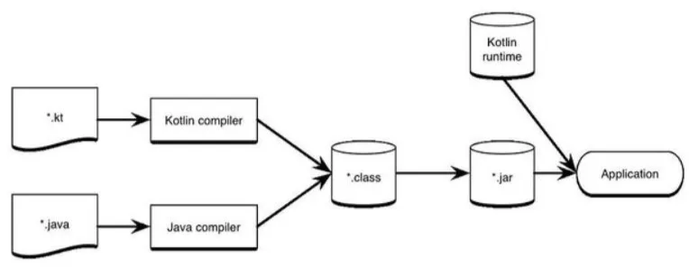

### 자바-코틀린 변환기

새로운 언어를 사용해 속도를 높이려면 노력이 필요하다. 다행히 우리는 여러분이 자바에 대해 알고있는 지식을 바탕으로 코틀린을 더 빠르게 배워서 써먹을 수 있도록 지름길을 마련해뒀다. 자바-코틀린 변환기 (Java-to-Kotlin converter)는 자동으로 자바를 코틀린으로 변환해주는 변환기다.

코틀린을 배우기 시작했을 때 정확히 코틀린 문법이 기억나지 않는 경우 이 변환기를 유용하게 써먹을 수 있다.

### 1.5.2 코틀린 코드 컴파일

코틀린은 컴파일 언어다. 이는 코틀린 코드를 실행하기 위해서는 반드시 코드를 컴파일해야 한다는 뜻이다. 코틀린 코드를 다른 여러 타깃으로 컴파일이 가능하다.

- JVM에서 실행되는 JVM 바이트코드 (.class 파일에 저장됨)
- 추가 변환 후 안드로이드에서 실행되기 위한 JVM 바이트코드
- 다른 운영체제에서 네이티브로 실행되기 위한 네이티브 타깃
- 브라우저에서 실행되기 위한 자바스크립트 (또는 웹어셈블리)

코틀린 컴파일러에게는 생성된 JVM 바이트코드가 JVM에서 실행될지 더 변환 후 안드로이드에서 실행될지는 중요하지 않다. 안드로이드 런타임 (ART, Android RunTime)은 JVM 바이트코드를 Dex 바이트코드로 변환하고 JVM 바이트코드 대신 Dex 바이트코드를 실행한다. 이는 안드로이드 관련 문서를 보면 확인할 수 있다.

### 코틀린/JVM에서의 컴파일 과정

코틀린 소스 코드를 저장할 때는 보통 .kt라는 확장자를 파일에 붙인다. 코틀린 컴파일러는 자바 컴파일러가 자바 소스코드를 컴파일할 때와 마찬가지로 코틀린 소스코드를 분석해서 .class 파일을 만들어낸다.

만들어진 .class 파일은 여러분이 개발중인 애플리케이션의 유형에 맞는 표준 패키징 과정을 거쳐 실행될 수 있다. 가장 간단한 방식은 커맨드라인에서 kotlinc 명령을 통해 코틀린 코드를 컴파일한 다음 java 명령으로 그 코드를 생행하는 것이다.

```
kotlinc <소스파일 또는 디렉터리> -include-runtime -d <jar 이름>
jar -jar <jar 이름>
```

자바 가상머신은 원래 코드가 코틀린이나 자바 중 어느 언어로 작성됐는지는 알지 못해도 코틀린 코드에서 빌드된 .class 파일을 실행할 수 있다.

하지만 코틀린 내장 클래스와 API는 의존관계로, 코틀린 런타임 라이브러리 (Kotlin runtime library)라는 추가 정보가 필요하다. 커맨드라인에서 코드를 컴파일할 때는 명시적으로 -include-runtime을 호출해서 결과로 생기는 JAR 파일안에 런타임 라이브러리를 포함시켜야 한다.

코틀린 런타임 라이브러리에는 Int나 String 같은 코틀린 기본 클래스의 정의가 들어가 있고, 표준 자바 API에 대한 확장도 들어 있다. 우리의 애플리케이션을 배포할 때는 런타임 라이브러리도 함께 배포할 필요가 있다.



추가로 코틀린 표준 라이브러리 (Kotlin standard library)도 애플리케이션의 의존관계로 필요하다.
이론적으로 코틀린 표준 라이브러리 없이도 코드를 작성할 수 있지만 실제로는 결코 그런 식으로 코드를 작성하지 않을 것이다.

실제로 개발을 진행한다면 메이븐 (Maven), 그레이들(Gradle) 등의 빌드 시스템을 사용할 것이다. 코틀린은 그런 빌드 시스템과 호환된다. 이런 빌드 시스템은 모두 코틀린과 자바가 코드베이스에 함께 들어잇는 혼합 언어 프로젝트를 지원한다. 메이븐과 그레이들은 애플리케이션을 패키징할 때 알아서 코틀린 런타임과 최신 코틀린 표준 라이브러리를 의존관계에 포함시켜준다. 따라서 이들을 명시적으로 포함시킬 필요가 없다.

```
https://kotlinlang.org/docs/gradle.html
https://kotlinlang.org/docs/maven.html
```

위에서 세부 내용을 확인할 수 있다.
