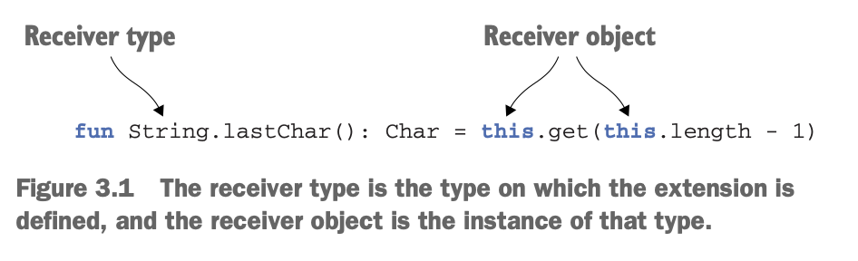
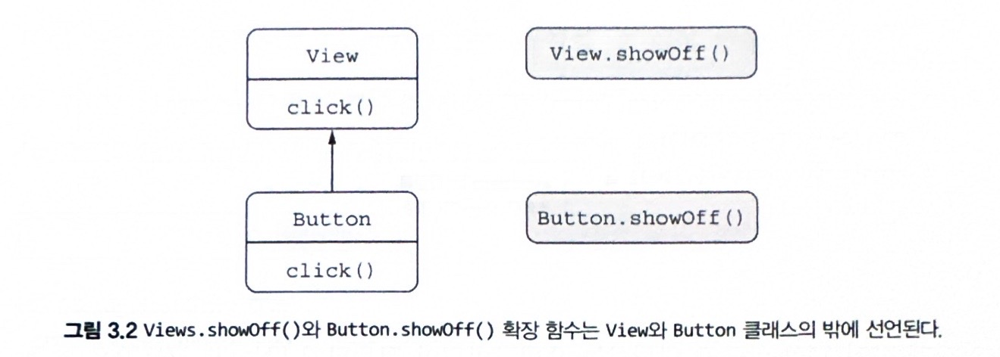

### 3.3 메서드를 다른 클래스에 추가 : 확장 함수와 확장 프로퍼티

기존 코드와 코틀린 코드를 자연스럽게 통합하는 것은 코틀린의 핵심 목표중 하나다. 완전히 코틀린으로만 이뤄진 프로젝트조차도 JDK나 안드로이드 프레임워크 또는 다른 서드파티 프레임워크 등의 자바 라이브러리를 기반으로 만들어 진다.

또한 코틀린을 기존 자바 프로젝트에 통합하는 경우에는 코틀린으로 직접 변환할 수 없거나 미처 변환하지 못한 기존 자바 코드를 처리할 수 있어야 한다. 이런 지노 자바 API를 재작성하지 않고도 편리한 여러 기능을 사용할 수 있다면 좋은 일이 아닐까? 바로 확장 함수 (extension function)가 그런 역할을 해줄 수 있다.

개념적으로 확장 함수는 단순하다. 확장 함수는 어떤 클래스의 멤버 메서드인것처럼 호출할 수 있지만 그 클래스의 밖에 선언된 함수이다.

확장 함수를 보여주기 위해 어떤 문자열의 마지막 문자를 돌려주는 메서드를 예제로 들어보자

```kotlin
package strings

fun String.lastChar(): Char = this.get(this.length - 1)
```

해야 할 일은 추가 함수 이름 앞에 그 함수가 확장할 클래스의 이름을 덧붙이는 것뿐이다.

- 이런 클래스 이름을 수신 객체 타입 (receiver type)이라 부르며,
- 확장 함수 호출 시 우리가 호출하는 대상 값(객체)를 수신 객체 (receiver object)라고 부른다.



이 함수를 호출하는 구문은 일반적인 클래스 멤버를 호출하는 구문과 같다.

```kotlin
fun main() {
    println("Kotlin".lastChar())
}

// n
```

- 이 예제에서 String이 수신 객체 타입이고 "Kotlin"이 수신 객체이다.

어떤 면에서는 이는 String 클래스에 여러분의 메서드를 추가하는 것과 같다. String 클래스가 여러분의 코드에 속하지 않았고 심지어 String 클래스의 소스코드를 우리가 소유한 것도 아니지만, 여전히 원하는 메서드를 String 클래스에 추가할 수 있다.

심지어 String이 자바나 코틀린 등의 언어 중 어떤 것으로 쓰였는가는 중요하지 않다. 예를 들어 그루비(Grooby)와 같은 다른 JVM 언어로 작성된 클래스도 확장할 수 있고, final로 상속을 할 수 없게 선언된 경우에도 문제가 되지 않는다. 자바 클래스로 컴파일된 클래스 파일이 있는 한 그 클래스를 원하는 대로 확장을 추가할 수 있다.

일반 메서드 본문에서 this 를 사용할 때와 마찬가지로 확장 훔수 본문에도 this를 쓸 수 있고 this 를 생략할 수 있다.

> this 생략 가능

```kotlin
package strings

// 수신 객체 멤버를 this 없이 접근 가능하다.
fun String.lastChar(): Char = get(length - 1)
```

확장 함수 내부에서는 일반적인 인스턴스 메서드의 내부와 마찬가지로 수신 객체의 메서드나 프로퍼티를 바로 사용할 수 있다.

하지만 확장 함수가 캡슐화를 깨지 않는다는 사실을 기억해야 한다. 클래스 안에서 정의한 메서드와 달리 확장 함수 안에서는 클래스 내부에서만 사용할 수 있는 비공개 (private) 멤버나 보호된 (protected) 멤버를 사용할 수 없다.

### 3.3.1 임포트와 확장 함수확장

함수를 정의했다고 해도 자동으로 프로젝트 아느이 모든 소스코드에서 그 함수를 쓸 수 있지는 않다. 확장 함수를 쓰려면 다른 클래스나 함수와 마찬가지로 해당 함수를 임포트해야만 한다. 이는 이름 충돌을 막기 위함이다. 코틀린에서는 클래스를 임포트할 때와 같은 구문을 사용해 개별 함수를 임포트할 수 있다.

as 키워드를 사용하면 임포트한 클래스나 함수를 다른 이름으로도 부를 수 있다.

> as 키워드

```kotlin
import strings.lastChar as last

fun main() {
    val c = "Kotlin".last()
}
```

### 3.3.2 자바에서 확장 함수 호출

내부적으로 확장 함수는 수신 객체를 첫번째 인자로 받는 정적 메서드이다. 따라서 확장 함수를 호출해도 다른 어댑터(adapter)객체나 실행 시점 부가 비용이 들지 않는다.

이런 설계로 인해 자바에서는 확장 함수를 사용하기도 편하다. 단지 정적 메서드를 호출하면서 첫번째 인자로 수신 객체를 넘기면 된다. 다른 최상위 함수와 마찬가지로 확장 함수가 들어있는 자바 클래스 이름도 확장 함수가 들어있는 파일 이름에 따라 결정된다.

따라서 확장 함수를 StringUtil.kt 파일에 정의했다면 다음과 같다.

```java
/* Java */
char c = StringUtilKt.lastChar("Java");
```

이 확장 함수는 최상위 함수로 선언됐다. 따라서 정적 메서드로 컴파일 된다. 자바에서는 alstChar를 정적으로 임포트해서 단순히 lastChar("Java")라고 호출할 수도 있다. 이런 자바 코드는 때로는 코틀린의 호출 방식보다 가독성이 떨어지지만 자바의 관점에서 볼 때는 전형적인 자바 코드이다.

### 3.3.3 확장 함수로 유틸리티 함수 정의

이제 joinToString 함수의 최종 버전을 만들자. 이제 이 함수는 코틀린 라이브러리가 제공하는 함수와 거의 같아졌다.

> joinToString()을 확장으로 정의하기

```kotlin
// Collection<T>에 대한 확장 함수를 선언한다.
fun <T> Collection<T>.join(
    separator: String = ", ",
    prefix: String = "",
    postfix: String = ""
): String {
    val result = StringBuilder(prefix)

    for ((index, element) in this.withIndex()) {
        if (index > 0) result.append(separator)
        result.append(element)
    }

    result.append(postfix)
    return result.toString()
}
```

```kotlin
fun main() {
    val list = listOf(1,2,3)
    println(
        list.joinToString()
    )
}
```

### 3.3.4 확장 함수는 오버라이드 할 수 없다.

코틀린의 메서드 오버라이드도 일반적인 객체지향의 메서드 오버라이드와 마찬가지다. 하지만 확장 함수는 오버라이드할 수 없다. View와 그 하위 클래스인 Button 이 있는데, Button이 상위 클래스의 click 함수를 오버라이드하는 경우를 생각해보자

이를 구현하려면 하위 클래스에서 click의 구현을 제공할 수 있도록 상위 클래스 코드에 open 변경자를 추가해야 한다. (이 구문은 4.1.1절에서 자세히 다룬다.)

> 멤버 함수 오버라이드하기

```kotlin
open class View {
    open fun click() = println("View click!")
}

// View 를 확장한 Button 클래스
class Button : View() {
    override fun click() = println("Button click!")
}
```

Button 이 View의 하위 타입이기 때문에 View 타입 변수를 선언해도 Button 타입 변수를 그 변수에 대입이 가능하다.

하지만 확장은 이런 식으로 작동하지 않는다. 밑 그림과 같이 확장 함수는 클래스의 일부가 아니다.



이름과 파라미터가 완전히 같은 확장 함수를 기반 클래스와 하위 클래스에 대해 정의할 수 있지만, 실제 호출될 함수는 확장 함수를 호출할 때 수신 객체로 지정한 변수의 컴파일 시점의 타입에 의해 결정되지, 실행시간에 그 변수에 저장된 객체의 타입에 의해 결정되지 않는다.

다음 예제는 View와 Button 클래스에 대해 선언된 두 showOff 확장 함수를 보여준다. View 타입의 변수에 대해 showOff를 호출하면 그 변수 안에 들어있는 값이 실제로는 Button 타입이엇다 해도 View 타입에 해당하는 확장 함수가 호출된다.

> 확장 함수는 오버라이드 할 수 없다.

```kotlin
fun View.showOff() = println("I'm a view")
fun Button.showOff() = println("I'm a button")

fun main() {
    val view : View = Button()
    println(view.showOff())
}

// I'm a view
```

확장 함수를 첫번째 인자가 수신 객체인 정적 자바 메서드로 컴파일한다는 사실을 기억하면 동작을 이해할 때 도움이 된다. 자바도 마찬가지 방식으로 호출할 static 함수를 결정한다.

> Java

```java
class Main {
    public static void main(String[] args) {
        View view = new Button();
        // extensions.kt 파일에 정의한 showOff 함수
        ExtensionKt.showOff(view);
    }
}
```

예제와 같이 확장 함수에 대해서는 오버라이딩이 적용되지 않는다. 코틀린은 호출될 확장 함수를 정적으로 결정하기 때문이다.

### 3.3.5 확장 프로퍼티

확장 프로퍼티를 사용하면 함수가 아니라 프로퍼티 형식의 구문으로 사용할 수 있는 API를 추가할 수 있다.

프로퍼티라는 이름으로 불리기는 하지만 상태를 저장할 적절한 방법이 없기 때문에 (기존 자바 인스턴스에 필드를 추가할 방법은 없다.) 실제로 확장 프로퍼티는 아무 상태도 가질 수 없다. 따라서 확장 프로퍼티는 항상 2.2.2절에서 다룬 것과 같은 커스텀 접근자를 정의한다.

접근자를 호출할 때 함수 호출 문법 대신 프로퍼티 문법으로 더 짧게 코드를 작성할 수 있어 편한 경우가 많다.

> 확장 프로퍼티 선언하기

```kotlin
val String.lastChar : Char
    get() = get(length - 1)
```

확장 함수의 경우와 마찬가지로 확장 프로퍼티도 단지 프로퍼티에 수신 객체 클래스가 추가됐을 뿐임을 알 수 있다. 뒷받침하는 필드가 없어 기본 게터구현을 제공할 수 없으므로 최소한 게터는 꼭 정의를 해야한다. 마찬가지로 초기화 코드에서 계산한 값을 담을 장소가 전혀 없으므로 코드도 쓸 수 없다.

StringBuilder의 맨 마지막 문자를 변경할 수 있으므로 StringBuilder에 대해 같은 프로퍼티를 정의한다면 이를 var로 만들 수 있다.

```kotlin
var StringBuilder.lastChar : Char
    get() = get(length - 1)
    set(value : Char) {
        this.setCharAt(length - 1, value)
    }
```

확장 프로퍼티를 사용하는 방법은 멤버 프로퍼티를 사용하는 방법과 같다.

```kotlin
fun main() {
    val sb = StringBuilder(("Kotlin?"))
    print(sb.lastChar) // ?
    sb.lastChar = '!'
    println(sb) // Kotlin!
}
```
