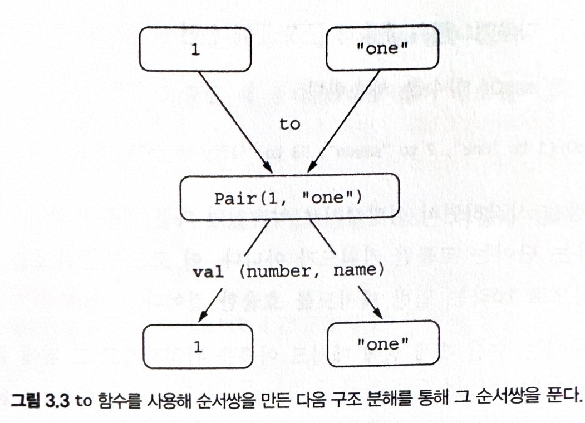

### 3.4 컬렉션 처리 가변 길이 인자, 중위 함수 호출, 라이브러리 지원

이번 절은 컬렉션을 처리할 때 쓸 수 있는 코틀린 표준 라이브러리 함수 몇 가지를 보여준다. 그 과정에서 다음 코틀린 언어 특성을 설명한다.

- vararg 키워드를 사용하면 호출 시 인자 개수가 달라질 수 있는 함수를 정의할 수 있다.
- 중위 (infix) 함수 호출 구문을 사용하면 인자가 하나뿐인 메서드를 간편하게 호출할 수 있다.
- 구조 분해 선언 (destructuring declaration)을 사용하면 복합적인 값을 분해해서 여러 변수에 나눠 담을 수 있다.

### 3.4.1 자바 컬렉션 API 확장

이번 장의 맨 앞부분에서 코틀린 컬렉션은 자바와 같은 클래스를 사용하지만 더 확장된 API를 제공한다고 했다. 그리고 리스트의 마짐가 원소를 가져오는 예제와 수로 이뤄진 컬렉션의 합계를 찾는 예제를 살펴봤다.

```kotlin
fun main() {
    val strings: List<String> = listOf("first", "second", "three")
    strings.last()
    val numbers: Collection<Int> = setOf(1, 2, 4)
    numbers.sum()
}
```

어떻게 자바 라이브러리 클래스의 인스턴스인 컬렉션에 대해 코틀린이 새로운 기능을 추가할 수 있을까? 이제 답이 명확하자 last와 max는 모두 확장 함수로 정의되고 항상 코틀린 파일에서 디폴트로 임포트된다.

```kotlin
public fun <T> List<T>.last(): T (/* .. */) {/* .. */}
public fun Iterable<Int>.sum(): Int (/* .. */) {/* .. */}
```

이런 함수의 특징은 바로 인자의 개수가 그때그때 달라질 수 있는 점이다.

### 3.4.2 가변 인자 함수 : 인자의 개수가 달라질 수 있는 함수 정의

```kotlin
val list = listOf(1,2,3,4)
```

표준 라이브러리에서 이 함수가 어떻게 정의됐는지 보면 다음과 같은 시그니처를 볼 수 있다.

```kotlin
public fun <T> listOf(vararg elements: T): List<T> = /* .. */
```

이 함수는 호출할 때 원하는 개수만큼 여러 값을 인자로 넘기면 배열에 그 값들을 넣어주는 언어 기능인 가변 길이 인자 (varags)를 사용한다.

자바는 ... 을 붙이는 대신 코틀린에서는 파라미터 앞에 vararg 변경자를 붙인다.

```kotlin
fun main(args : Array<String>) {
    // 스프레드 연산자가 배열의 내용을 펼쳐준다.
    val list = listOf("args:" , *args)
}
```

### 3.4.3 쌍(튜플) 다루기 : 중위 호출과 구조 분해 선언

맵을 만들려면 mapOf 함수를 사용한다.

```kotlin
val map = mapOf(1 to "one", 2 to "two")
```

여기서 to 라는 단어는 코틀린 키워드가 아니다. 이 코드는 중위 호출 (infix call) 이라는 특별한 방식으로 to라는 일반 메서드를 호출한 것이다.

중위 호출 시에는 수신 객체 뒤에 메서드 이름을 위치시키고 그 뒤에 유일한 메서드 인자를 넣는다. (이때 다른 구분자는 필요없고 각각을 공백으로 분리한다.)

다음 두 호출을 동일하다.

```kotlin
1.to("one") // to 함수를 일반적인 방식으로 호출
1 to "one"  // to 함수를 일반적인 방식으로 호출
```

인자가 하나뿐인 일반 메서드나 인자가 하나뿐인 확장 함수에만 중위 호출을 사용할 수 있다.
함수를 중위 호출에 사용하게 허용하고 싶으면 infix 변경자를 함수 선언 앞에 추가해야 한다.

다음은 to 함수의 정의를 간략하게 줄인 코드이다.

```kotlin
infix fun <A, B> A.to(that: B): Pair<A, B> = Pair(this, that)
```

이 to 함수는 Pair의 인스턴스를 반환한다. Pair는 코틀린 표준 라이브러리 클래스로, 이름 그대로 두 원소 이뤄진 순서쌍을 표현한다. 실제로 to는 제네릭 함수지만 여기서는 단순화를 위해 세부 사항을 생략했다.

Pair의 내용을 갖고 두 변수를 즉시 초기화할 수 있다.

```kotlin
val (number , name) = 1 to "one"
```

이것이 바로 구조 분해 선언 (destructuring declaration) 이라고 부른다. 다음 그림은 Pair에 대해 구조 분해가 어떻게 동작하는지 보여준다.



구조 분해는 순서쌍에만 한정되지 않는다.

```kotlin
val list = listOf(1, 2)
for ((index, element) in list.withIndex()) {
    /**/
}
```

9장에서 식의 구조 분해와 구조 분해를 사용해 여러 변수를 초기화하는 방법에 대한 일반 규칙을 다룬다.

to 함수는 확장함수이다. to를 사용하면 타입과 관계없이 임의의 순서쌍을 만들 수 있다. 이는 to의 수신 객체가 제네릭이라는 뜻이다.

mapOf 함수의 시그니처도 한번 보자

```kotlin
fun <K, V> mapOf(vararg pairs: Pair<K, V>): Map<K, V>
```
