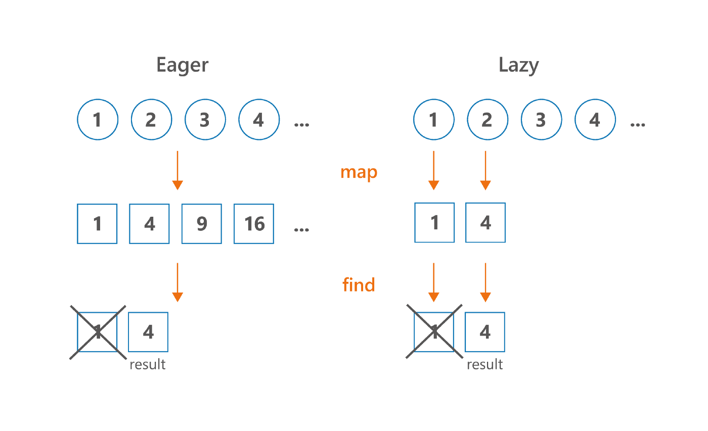

### 6.2 지연 계산 컬렉션 연산 : 시퀀스

앞 절에서는 map이나 filter 컬렉션 함수들을 연쇄적으로 호출하는 경우도 살펴봤다. 그런 함수는 결과 컬레션을 즉시 (eagerly) 생성한다. 이는 컬렉션 함수를 연쇄하면 매 단계마다 계산 중간 결과를 새로운 컬렉션에 임시로 담는다는 의미이다. 시퀀스 (sequence)는 자바 8의 스트림과 비슷하게 중간 임시 컬렉션을 사용하지 않고 컬렉션 연산을 연쇄하는 방법을 제공한다.

```kotlin
people.asSequence()
      .map(Person::name)
      .filter { it.startsWith("A") }
      .toList()
```

전체 연산을 수행한 결과는 이름이 A로 시작하는 사람의 리스트로 이전의 예제와 같다. 하지만 방금 살펴본 예제에서는 중간 겨로가를 저장하는 컬렉션이 생기지 않기 때문에 원소가 많은 경우 성능이 눈에 띄게 좋아진다.

코틀린 지연 계산 시퀀스는 Sequence 인터페이스에서 시작한다. 이 인터페이스는 단지 한 번에 하나씩 열거될 수 있는 원소의 시퀀스를 표현할 뿐이다. Sequence 안에는 iteator라는 단 하나의 메서드가 들어있다. 그 메서드를 통해 시퀀스에서 원소 값들을 얻을 수 있다.

Sequence 인터페이스의 강점은 그 인터페이스 위에 구현된 연산이 계산을 수행하는 방법 때문에 생긴다. 시퀀스의 원소는 필요할 때 lazy 계산된다.

따라서 중간 처리 결과를 저장할 컬렉션을 만들지 않고도 연산을 연쇄적으로 적용해서 연쇄적인 연산을 효율적으로 수행할 수 있다. 게다가 시퀀스에 대해 일반 리스트를 처리할 때 사용하던 map, filter 등의 연산을 똑같이 적용할 수 있다는 점도 좋다.

asSequence 확장 함수를 호출하면 어떤 컬렉션이든 시퀀스로 바꿀 수 있고, 시퀀스를 다시 리스트로 만들 때는 toList를 사용한다.

### 6.2.1 시퀀스 연산 실행: 중간 연산과 최종 연산

시퀀스에 대한 연산은 중간 (intermediate) 연산과 최종 (terminal) 연산으로 나뉜다. 중간 연산은 다른 시퀀스를 반환한다. 이 시퀀스는 최초 시퀀스의 원소를 변환하는 방법을 안다. 최종 연산을 결과를 반환한다. 결과는 최초 컬렉션에 대해 변환을 적용한 시퀀스에서 일련의 계산을 수행해 얻을 수 있는 컬렉션이나 원소, 수, 또는 다른 객체다.

중간 연산은 항상 지연 계산된다. 최종 연산이 없는 예제를 살펴보자

> 최종 연산이 없는 예제

```kotlin
fun main() {
    val result = listOf(1, 2, 3, 4).asSequence()
                                    .map {
                                    print("map($it)")
                                    it * it
                                    }
                                    .filter {
                                        print("filter($it)")
                                        it % 2 == 0
                                    }
    println(
        result
    )
}

// kotlin.sequences.FilteringSequence@1a86f2f1
```

이코드를 실행하면 아무 내용도 출력되지 않는다. 시퀀스의 원소들이 출력되는 대신 Sequence 객체에 대한 출력을 볼 수 있다.

> 최종연산 (toList)를 사용해 지연된 map 과 filter 변환 결과를 얻기

```kotlin
fun main() {
    val result = listOf(1, 2, 3, 4).asSequence()
                                    .map {
                                    print("map($it)")
                                    it * it
                                    }
                                    .filter {
                                        print("filter($it)")
                                        it % 2 == 0
                                    }
                                    .toList()
    println(
        result
    )
}

// map(1)filter(1)map(2)filter(4)map(3)filter(9)map(4)filter(16)[4, 16]
```

최종 연산 (toList)를 호출하면 연기됐던 모든 계산이 수행된다.

> 시퀀스의 큰 장점

```kotlin
fun main() {
    println(
        listOf(1,2,3,4)
            .asSequence()
            .map { it * it }
            .find { it > 3 }
    )
}
```

같은 연산을 시퀀스가 아니라 컬렉션에 수행하면 map 결과가 먼저 평가된 후 find로 술어를 만족하는 원소를 찾는다. 다만 시퀀스를 사용하면 지연 계산으로 인해 원소 중 일부의 계산은 이뤄지지 않는다.



또한, 컬렉션에 대해 수행하는 연산의 순서도 성능에 영향을 끼친다.

```kotlin
class Person(val name: String, val age: Int);

fun main() {
    var people = listOf(
        Person("Alice", 29),
        Person("Bob", 31),
        Person("Charles", 31),
        Person("Dan", 21),
    )

    // map 연산 수행 후 filter 수행
    println(
        people
            .asSequence()
            .map(Person::name)
            .filter { it.length > 4 }
            .toList()
    )
   // [Alice, Charles]

    // filter 수행 후 map 수행
    println(
        people
            .asSequence()
            .filter { it.name.length > 4 }
            .map(Person::name)
            .toList()
    )
    // [Alice, Charles]
}
```

map 을 먼저 하면 모든 원소를 반환한다. 하지만 filter를 먼저 하면 부적절한 원소를 먼저 제외하기 때문에 그런 원소는 변환되지 않는다. 대략적인 규칙으로, 연쇄적인 연산에서 더 빨리 원소들을 제거할 수록 코드의 성능이 더 좋아진다.

### 6.2.2 시퀀스 만들기

시퀀스를 만드는 다른 방법으로 generateSequence 함수를 사용할 수 있다. 이 함수는 이전의 원소를 인자로 받아 다음 원소를 계산한다.

> genarateSequence 함수 사용하기

```kotlin
fun main() {
    // 무한 시퀀스를 만든다.
    val naturalNumbers = generateSequence(0) { it + 1 };
    // 유한 시퀀스를 만든다. (1 ~ 100)
    val numbersTo100 = naturalNumbers.takeWhile { it <= 100 };
    // 합을 구한다.
    println(numbersTo100.sum());
}

// 5050
```

이 예제에서 naturalNumbers (무한 시퀀스)와 numbersTo100 (유한 시퀀스)는 모두 시퀀스이며 연산을 지연 계산한다. 최종 연산인 sum 을 수행하기 전까지는 시퀀스의 각 수는 계산되지 않는다.

시퀀스를 사용하는 일반적인 용례 중 하나는 객체의 조상들로 이뤄진 시퀀스를 만들어내는 것이다. 어떤 객체의 조상이 자신과 같은 타입이고, 모든 조상의 시퀀스에서 어떤 특성을 알고 싶을 때가 있다. 사람이나 파일 디렉터리의 계층 구조가 그런 예이다.

다음 예제는 어떤 파일의 상위 디렉터리를 뒤지면서 숨김(hidden) 속성을 가진 디렉터리가 있는지 검사한다.

> 조상 디렉터리의 시퀀스를 생성하고 사용하기

```kotlin
import java.io.File

fun File.is_inside_hidden_directory() = generateSequence(this) { it.parentFile }.any { it.isHidden }

fun main() {
    val file = File("어떠한 경로");
    println(file.is_inside_hidden_directory())
}
```
