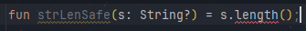
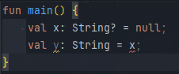

### 7.2 널이 될 수 있는 타입으로 변수 명시

널이 될 수 있는 타입으로 명시하려면 타입 이름 뒤에 물음표(?)를 명시해야 한다.

```kotlin
fun strLenSafe(s : String?) ...
```

String?, Int?, MyCustomType? 등 어떤 타입이든 타입 이름 뒤에 물음표를 붙이면 그 타입의 변수나 프로퍼티에 null 참조를 저장할 수 있다.

다시 말해 물음표가 없는 타입은 어떤 변수가 null 참조를 저장할 수 없다는 의미이다. 따라서 모든 타입이 기본적으로 null이 아닌 타입이다.

어떤 널이 될 수 있는 타입의 값이 있다면 그 값에 대해 수행할 수 있는 연산의 종류가 제한된다. 예를 들어 널이 될 수 있는 타입 값의 메서드를 직접 호출할 수는 없다.



널이 될 수 있는 값을 널이 될 수 없는 타입의 변수에 대입할 수 없다.



널이 될 수 있는 타입의 값을 null이 아닌 타입의 파라미터를 받는 함수에 전달 할 수 없다.

```kotlin
fun strLenSafe(s : String) = s.length

fun main() {
    val x: String? = null;
    strLenSafe(x) // 불가
}
```

이렇게 제약이 많다면 널이 될 수 있는 타입의 값으로 대체 뭘 할 수 있을까? 가장 중요한 일은 바로 null과 비교하는 것이다. 일단 null과 비교하고 나면 컴파일러는 그 사실을 기억하고 null이 아님이 확실한 영역에서는 해당 값을 null이 아닌 타입의 값처럼 사용할 수 있다.

```kotlin
fun strLenSafe(s: String?): Int = if (s != null) s.length else 0;

fun main() {
    val x: String? = null;
    println(strLenSafe(x))
}

// 0
```

널 가능성을 다루기 위해 사용할 수 있는 도구가 if 검사뿐이라면 코드가 금방 번잡해질 것이다. 다행히 코틀린은 널이 될 수 있는 값을 다룰 때 도움이 되는 여러 도구를 제공한다.
