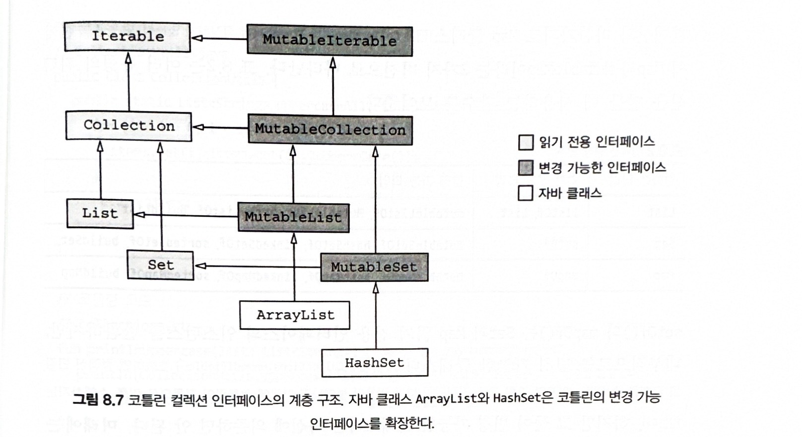

### 8.2 컬렉션과 배열

### 8.2.1 널이 될 수 있는 값의 컬렉션과 널이 될 수 있는 컬렉션

8장의 앞에서 널이 될 수 있는 타입을 설명했다. 그때 타입 인자의 널 가능성에 대해서는 아주 간략히 다뤘지만 사실 이는 타입 시스템 일관성을 지키기 위해 필수적으로 고려해야할 사항이다.

컬렉션에 null을 넣을 수 있는지 여부는 어떤 변수의 값이 null이 될 수 있는지 여부와 마찬가지로 중요하다. 변수 타입 뒤에 ?를 붙이면 그 변수에 null을 저장할 수 있다는 뜻인것 처럼 타입 인자로 쓰인 타입에도 같은 표시가 가능하다.

> 널이 될 수 있는 값으로 이뤄진 컬렉션 만들기

```kotlin
fun readNumbers(text:String): List<Int?> {
    val result = mutableListOf<Int?>()
    // 입력 문자열을 한 줄씩 순회한다.
    for (line in text.lineSequence()) {
        val numberOrNull = line.toIntOrNull()
        result.add(numberOrNull)
    }
    return result
}
```

만약 널이 될 수 있는 Int로 이뤄진 리스트와 리스트 자체가 널인 경우 차이를 보자

첫번째의 경우 리스트 자체는 항상 null이 아니지만, 안의 값이 null이 될 수 있다. 두번째의 경우 리스트를 가리키는 변수가 null일 수도 있다.

둘 다 허용하려면 코틀린에서는 물음표를 2개 사용해 List<Int?>?로 이를 표현한다. 이런 리스트를 처리할 때는 변수에 대해 null 검사 후 모든 원소에 대해 다시 null 검사를 해야한다.

### 8.2.2 읽기 전용과 변경 가능한 컬렉션

코틀린 컬렉션과 자바 컬렉션을 나누는 가장 중요한 특성 중 하나는 코틀린에서는 컬렉션 안의 데이터에 접근하는 인터페이스와 컬렉션 안의 데이터를 변경하는 인터페이스를 분리했다는 점이다.

이런 구분은 코틀린 컬렉션을 다룰때 사용하는 가장 기초적인 인터페이스인 kotlin.collections.Collection부터 존재한다. 이 Collection 인터페이스를 사용하면 컬렉션 안의 원소에 대해 이터레이션하고, 컬렉션의 크기를 어도 등의 연산을 수행할 수 있다. 하지만 Collection에는 원소를 추가하거나 제거하는 메서드가 없다.

컬렉션의 데이터를 수정하려면 kotlin.collections.MutableCollection 인터페이스를 사용한다. MutableCollection은 일반 인터페이스 Collection을 확장하면서 원소 추가, 삭제 등의 메서드를 좀 더 제공한다.

가능하면 코드에서 항상 읽기 전용 인터페이스(Collection)을 사용하는 것을 일반적인 규칙으로 삼자. 코드가 컬렉션을 변경할 필요가 있을 때만 변경 가능한 버전을 사용하자.

val과 var의 구별과 마찬가지로, 컬렉션의 읽기 전용 인터페이스와 변경 가능 인터페이스를 구별한 이유는 프로그램에서 데이터에 어떤 일이 벌어지는지를 더 쉽게 이해하기 위함이다. 어떤 컴포넌트의 내부 상태에 컬렉션이 포함된다면 그 컬렉션을 MutableCollection을 인자로 받는 함수로 전달할 때는 어쩌면 원본의 변경을 막고자 컬렉션을 복사해야할 수도 있다.

> 읽기 전용과 변경 가능한 컬렉션 인터페이스

```kotlin
fun <T> copyElements(source: Collection<T> ,
                     target : MutableCollection<T>) {
    for (item in source)
        target.add(item)
}

fun main() {
    val source: Collection<Int> = arrayListOf(3,5,6)
    val target: MutableCollection<Int> = arrayListOf(1)
    copyElements(source, target)
    print(target)
}
```

객체가 실제로는 변경 가능한 컬렉션이라도 target에 해당하는 인자로 읽기 전용 컬렉션 타입의 값을 넘길 수는 없다.

```kotlin
fun <T> copyElements(source: Collection<T> ,
                     target : MutableCollection<T>) {
    for (item in source)
        target.add(item)
}

fun main() {
    val source: Collection<Int> = arrayListOf(3,5,6)
    val target: Collection<Int> = arrayListOf(1)
    copyElements(source, target)
    print(target)
}

// Error : type mismatch
```

컬렉션 인터페이스를 사용할 때 항상 염두에 둬야 할 핵심은 읽기 전용 컬렉션이더라도 곡 변경 불가능한 컬렉션일 필요가 없다.

### 8.2.3 코틀린 컬렉션과 자바 컬렉션은 밀접히 연관됨

모든 코틀린 컬렉션은 그에 상응하는 자바 컬렉션 인터페이스의 인스턴스라는 점은 사실이다. 따라서 코틀린과 자바 사이를 오갈 때 아무 변환도 필요없다. 즉, 래퍼 클래스를 만들거나 데이터를 복사할 필요도 없다. 하지만 코틀린은 모든 자바 컬렉션 인터페이스마다 읽기 전용 인터페이스와 변경가능한 인터페이스라는 2가지 표현(representation)을 제공한다.



코틀린의 읽기 전용과 변경가능 인터페이스의 기본 구조는 java.util 패키지에 있는 자바 컬렉션 인터페이스의 구조와 같다. 추가로 각 변경 가능 인터페이스는 자신과 대응하는 읽기 전용 인터페이스를 확장(상속)한다. 변경 가능한 인터페이스는 java.util 패키지에 있는 인터페이스와 직접적으로 연관되지만 읽기 전용 인터페이스에는 컬렉션을 변경할 수 있는 모든 요소가 빠져잇다.

위 그림에서는 자바 표준 클래스를 코틀린에서 어떻게 취급하는지 보여주기 위해 java.util.ArrayList와 java.util.HashSet 클래스가 있다. 코틀린은 이들이 마치 각각의 코틀린의 MutableList와 MutableSet 인터페이스를 상속한 것처럼 취급한다. 자바 컬렉션 라이브러리에 있는 다른 구현은 따라 표시 하지 않았지만 코틀린은 그들도 마찬가지로 코틀린 상위 타입을 갖는것처럼 취급한다.

이런 방식을 통해 코틀린은 자바 호환성을 제공하는 한편 읽기 전용 인터페이스와 변경 가능 인터페이스를 분리한다.

| 컬렉션 타입 | 읽기 전용 타입 |                       변경 가능 타입                        |
| :---------: | :------------: | :---------------------------------------------------------: |
|    List     |  listOf, List  |     mutableListOf, MutableList, arrayListOf, buildList      |
|     Set     |     setOf      | mutableSetOf, hashSetOf, linkedSetOf, sortedSetOf, buildSet |
|     Map     |     mapOf      | mutableMapOf, hashMapOf, linkedMapOf, sortedMapOf, buildMap |

setOf()와 mapOf()는 Set과 Map 읽기 전용 인터페이스의 인스턴스를 반환하지만 내부적으로는 변경가능하다. 하지만 그 둘이 변경가능한 클래스라는 사실에 의존하면 안된다. 미래에는 setOf나 mapOf가 진정한 불변 컬렉션 인스턴스를 반환하게 바뀔 수도 있다.

자바 메서드를 호출하되 컬렉션을 인자로 넘겨야한다면 따로 변환하거나 복사하는 등의 추가 작업없이 직접 컬렉션을 넘기면 된다. 예를 들어 java.util.Collection을 파라미터로 받는 자바 메서드가 있다면 아무 Colleciton이나 MutableCollection 값을 인자로 넘길 수 있다.

다만 코틀린에서 읽기전용으로 넘겼다 하더라도 자바에서 값을 바꿀 수 있으므로 유의해야한다.

### 8.2.4 자바에서 선언한 컬렉션은 코틀린에서 플랫폼 타입으로 보임

7장 앞에서 설명한 널 가능성을 기억한다면 자바 코드에서 정의한 타입을 코틀린에서는 플랫폼 타입으로 본다는 것을 알것이다. 플랫폼 타입의 경우 코틀린 쪽에는 널 관련 정보가 없다. 따라서 컴파일러는 코틀린 코드가 그 타입을 널이 될 수 있거나 없는 타입 둘 다 허용한다. 마찬가지로 자바 쪽에서 선언한 컬렉션 타입의 변수를 코틀린에서는 플랫폼 타입으로 본다.

따라서 코틀린 코드는 그 타입을 읽기 전용 또는 변경 가능 컬렉션션 어느쪽으로도 다룰 수 있으나 컬렉션 타입이 시그니처에 들어간 자바 메서드 구현을 오버라이드하려는 경우 읽기 전용 컬렉션과 변경 가능 켈력션의 차이가 문제가 된다.

플랫폼 타입에서 널 가능성을 다룰 때처럼 이런 경우에도 오버라이드하려는 메서드의 자바 컬렉션 타입을 어떤 코틀린 컬력센 타입으로 표현할 지 결정해야한다.

> 컬렉션 파라미터를 받는 자바 인터페이스

```java
interface FileContentProcessor {
  void procesContents(File path, byte[] binaryContents, List<String> textContens)
}
```

이 인터페이스를 코틀린에서 구현하려면 다음을 선택해야 한다.

- 일부 파일이 이진파일이고 이진 파일 내용은 텍스트로 표현할 수 없는 경우가 있으므로 리스트는 null이 될 수 있다.
- 파일의 각 줄은 null일 수 없으므로 이 리스트의 원소는 null이 될 수 없다.
- 이 리스트는 파일의 내용을 표현하며 그 내용을 바꿀 필요가 없으므로 읽기 전용이다.

> 코틀린으로 구현한 모습

```kotlin
class FileIndexer: FileContentProcessor {
  override fun processContents(
      path: File,
      binaryContents: ByteArray?,
      textContents: List<String>?
  )
  ...
}
```

### 8.2.5 성능과 상호운용을 위해 객체의 배열이나 원시 타입의 배열 만들기

자바 main 함수의 표준 시그니처에는 배열 파라미터가 들어있기 때문에 코틀린에서 시작하자마자 코틀린 배열 타입과 마주치게 된다. 다음 예제는 코틀린 배열이 어떻게 생겼는지 다시 한번 보여준다.

> 코틀린 배열

```kotlin
fun main(args: Array<String>) {
  for (i in args.indices) {
    println("Argument $i is: ${args[i]}")
  }
}
```

코틀린 배열은 타입 파라미터를 받는 클래스다. 배열의 원소 타입은 바로 그 타입 파라미터에 의해 정해진다.

코틀린에서 배열을 만드는 방법은 다양하다.

- arrayOf 함수는 인자로 받은 원소들은 포함하는 배열을 만든다.
- arrayOfNulls 함수는 모든 원소가 null인 정해진 크기의 배열을 만들 수 있다. 물론 원소 타입이 널이 될 수 있는 타입인 경우에만 가능하다.
- Array 생성자는 배열 크기와 람다를 인자로 받아 람다를 호출해서 각 배열 원소를 초기화해준다. 원소를 하나하나 전달하지 않으면서 원소가 널이 아닌 배열을 만들어야하는 경우 이 생성자를 사용한다.

> 예제 : 문자로 이뤄진 배열 만들기

```kotlin
fun main() {
    val letters = Array<String>(26) { i -> ('a' + i).toString()}
    println(letters.joinToString(""))
}

// abcdefghijklmnopqrstuvwxyz
```

이미 말한대로 코틀린에서는 배열을 인자로 받는 자바 함수를 호출하거나 vararg 파라미터를 받는 코틀린 함수를 호출하기 위해 가장 자주 배열을 만든다. 하지만 이때 데이터가 이미 컬렉션에 들어있다면 컬렉션을 배열로 변환해야한다. toTypeArray 메서드를 사용하면 쉽게 컬렉션을 배열로 바꿀 수 있다.

> 컬렉션을 vararg 메서드에게 넘기기

```kotlin
fun main() {
    val strings = listOf("a","b","c")
    println("%s %s %s".format(*strings.toTypedArray()))
}
```

- vararg 인자를 넘기기위해 스프레드 연산자(\*)를 사용해야 한다.

다른 제네릭 타입에서처럼 배열 타입의 타입 인자도 항상 객체 타입이 된다. 따라서 Array<Int>같은 타입을 선언하면 그 배열은 박싱된 정수의 배열 (자바 타입은 java.lang.Integer[])이다. 박싱하지 않은 원시 타입의 배열이 필요하다면 그런 타입을 위한 특별한 배열 클래스를 사용해야한다.

코틀린은 원시 타입의 배열을 표현하는 별도 클래스를 각 원시 타입마다 하나씩 제공한다. 예를 들어 Int 타입의 값들로 이뤄진 배열의 타입은 IntArray다. 코틀린은 ByeArray, CharArray, BooleanArray 등의 원시타입 배열은 제공한다. 이 모든 타입은 자바 원시 타입 배열인 int[], byte[], char[] 등으로 컴파일 된다. 따라서 그런 배열의 값은 박싱하지 않고 가장 효율적인 방식으로 저장된다.

원시 타입의 배열을 만드는 방법은 다음과 같다.

- 각 배열 타입의 생성자는 size 인자를 받아 해당 원시 타입의 기본값으로 초기화된 size크기의 배열을 반환
- 팩토리 함수(IntArray를 생성하는 intArrayOf 등)는 여러 값을 가변 인자로 받아 그런 값이 들어간 배열을 반환
- 크기와 람다를 인자로 받는 다른 생성자를 사용

> 첫번재와 두번째 방법으로 배열 만들기

```kotlin
fun main() {
    val fiveZeros = IntArray(5)
    val fiveZeros = intArrayOf(0,0,0,0,0)
}
```

다음은 람다를 사용해 만드는 방법이다.

> 람다를 이용해 배열 생성

```kotlin
fun main() {
    val squares = IntArray(5) { i -> (i + 1) * (i + 1) }
}
```

이 밖에 박싱된 값이 들어있는 컬렉션이나 배열에 toIntArray 등의 변환 함수를 사용할 수 있다. 6장에서 살펴본 함수 (filter, map 등)를 배열에 써도 잘 작동한다. 원시 타입인 원소로 이뤄진 배열에도 그런 확장 함수를 똑같이 사용할 수 있다.
